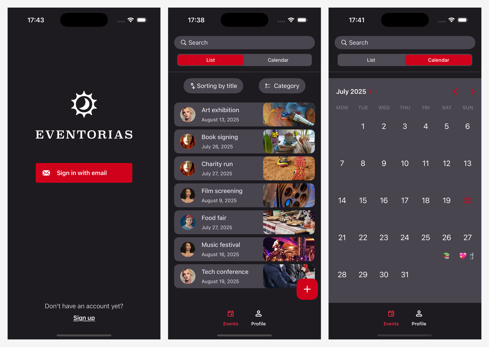
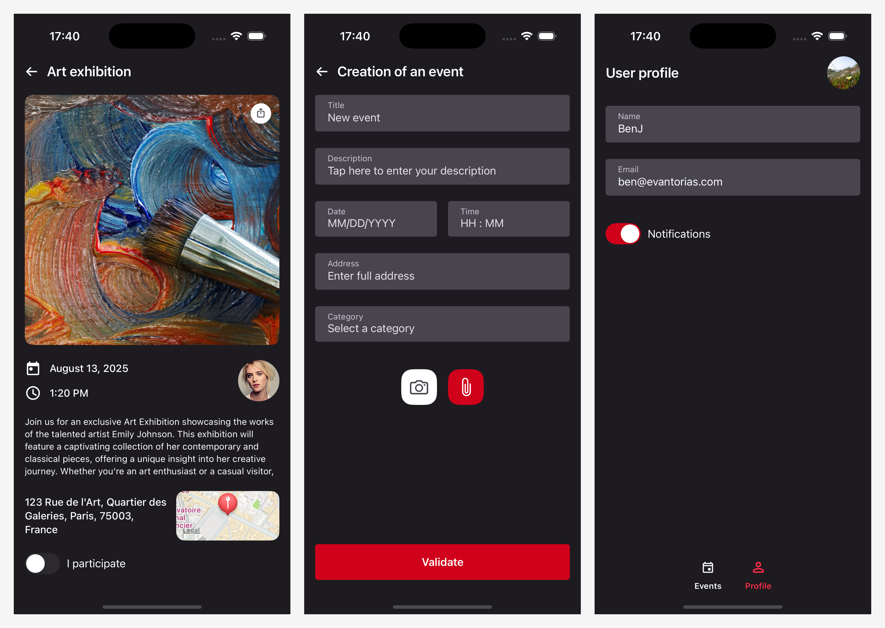

# OpenClassrooms : Développez une interface utilisateur liée à une base de données

Ce projet fait partie du parcours "Développeur d'application iOS" d'OpenClassrooms (projet 14).

L'objectif de ce projet était de créer une application mobile pour l’entreprise de gestion d'événements « Eventorias ».
Cette application doit permettre aux utilisateurs de créer, organiser, et partager des événements, avec les contraintes suivantes :
- Être accessible à tous les utilisateurs
- Suivre les bonnes pratiques en matière de sécurité
- Utiliser les dernières versions du SDK iOS
- Utiliser Firebase pour le stockage des données et l'authentification

# Captures d'écran de l'application

